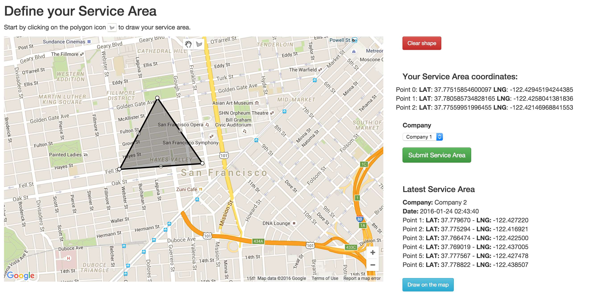
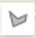
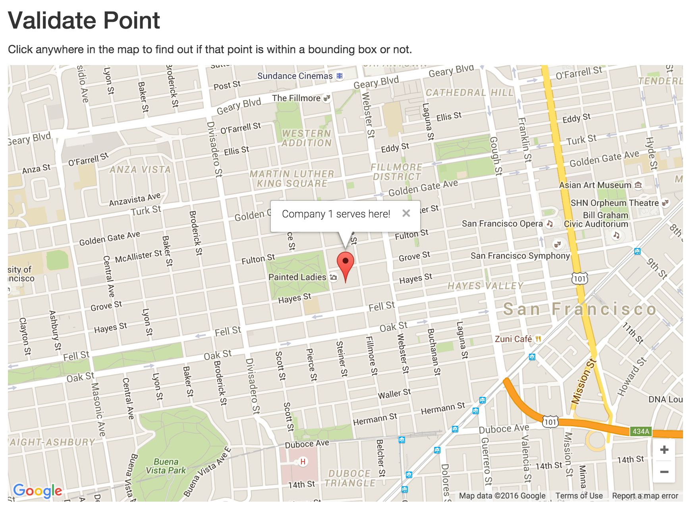

# Mozio - Service Area Drawing Tool

A simple django application to manage shuttle companies services areas using Google Maps Javascript API.

[](https://www.python.org/downloads/release/python-2710/) [](https://docs.djangoproject.com/en/1.9/) [](http://docs.fabfile.org/en/1.10/) [](https://dev.mysql.com/doc/refman/5.6/en/) [](https://developers.google.com/maps/documentation/javascript/)

## Installation
###### **Considering you already have a Python development environment setup.**

```bash
$ git clone https://github.com/mdsrosa/mozio_drawing_tool.git
$ cd mozio_drawing_tool
$ mkvirtualenv routes-api-dev
$ pip install -r requirements/dev.txt
```

### Running Locally
```bash
$ python manage.py migrate --settings=mozio_drawing_tool.settings.local
$ python manage.py runserver --settings=mozio_drawing_tool.settings.local
Performing system checks...

System check identified no issues (0 silenced).
January 24, 2016 - 03:05:53
Django version 1.9.1, using settings 'mozio_drawing_tool.settings.local'
Starting development server at http://127.0.0.1:8000/
Quit the server with CONTROL-C.
```

# Views

#### GET /mozio/index

This view is responsible for the interface where the user can define a service area.



#### How to use it
In the "Define your service area" page, start by clicking in the polygon icon  to draw your service area. The points you draw will show up on the right side with the `latitude` and `longitude` informations. You can edit the draw as much as you like. If you're sure that's your service area, select the company and then hit the `Submit Service Area` button, if not you can always hit the `Clean shape` button and start over.

#### GET /mozio/validate-point

This view is responsible for providing a map where you can click on any point on the map and find out if that point is within the bounding box.



#### How to use it
Click anywhere on the map to find out if that point is within a bounding box or not. If it doesn't find any Companies in that point it will tell you that that point is available.


## Tests
I love tests. But, since this is just a prototype of a solution for a specific problem, I didn't focus on them, I did focus more in the implementation itself.

## Possible improvements

Here are some ideas for this project that I think it could make the product better:

* Authentication by company
* Dashboard to show all the service areas in a list
* Possibility to edit a service area
* Possibility to delete a service area
* Suggest services areas for the company
* Register multiple service areas at once
* Temporary service areas (with due date)
* Company profile showing a marker on every service area it serves

That's some of my ideas based on the knowlodge I've about this specific project.